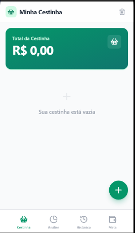
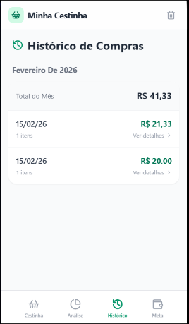

# Minha Cestinha

Aplicativo web para controle de compras com foco em usabilidade mobile. Permite cadastrar itens, acompanhar metas de gasto e visualizar historico e analises, com persistencia local via `localStorage`.

## Funcionalidades

- Cadastro de itens com quantidade, unidade e categoria
- Calculo automatico do total da cestinha
- Meta de gastos com barra de progresso
- Historico de compras finalizadas com detalhes
- Analise por categoria e comparacao de preco
- Interface responsiva otimizada para telas pequenas

## Tecnologias e stack

- React 19 (SPA com componentes funcionais e hooks)
- Vite 7 (build e dev server)
- Tailwind CSS 3 (estilizacao utilitaria)
- Lucide React (icone set)

## Requisitos

- Node.js 18+ (recomendado)
- npm 9+

## Scripts

- `npm run dev`: inicia o servidor de desenvolvimento
- `npm run build`: gera a build de producao
- `npm run preview`: preview local da build
- `npm run lint`: lint do projeto

## Como rodar o projeto

```bash
npm install
npm run dev
```

Acesse: `http://localhost:5173`

## Build de producao

```bash
npm run build
npm run preview
```

## Arquitetura e dados

- Estado global em `App.jsx` com `useState` e `useMemo`
- Persistencia via `localStorage` (itens, historico, meta)
- Formulario e modais controlados por estado local
- Regras de negocio e formatacao em helpers locais

## Estrutura de pastas

```
src/
  components/
    ui/
  data/
  views/
  App.jsx
  main.jsx
public/
  screenshots/
```

## Prints das telas





## Licenca

Este projeto e de uso livre para fins de estudo.
